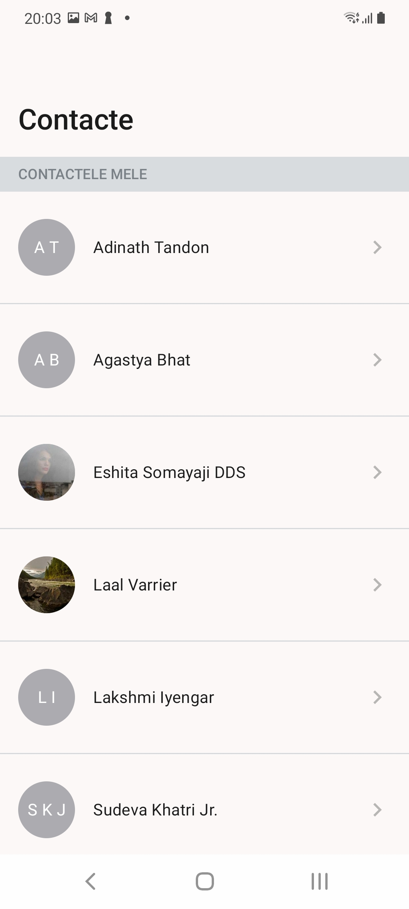
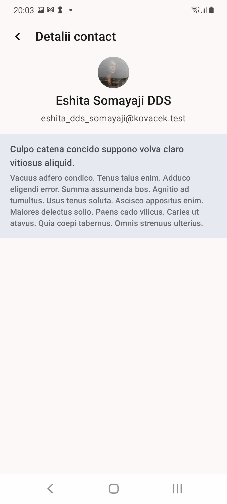

# Postmate App

## App Feature Description

## Overview

The Postmate App integrates Jetpack Compose, Coroutines, and follows the MVVM architecture to introduce two features: the "Contact List" and the "Contact Details".

### List of Users

The "Contact List" feature presents a comprehensive list of users, each comprising:

- **Photo**: The user's profile picture
- **Name**: The user's full name

#### Technical Implementation:

- **API Integration**: Utilizes Retrofit to communicate with the backend API following a repository pattern. The repository abstracts the data source, allowing seamless switching between local and remote data sources. Retrofit's Moshi converter facilitates JSON parsing into domain entities.
- **Data Filtering**: Implements data filtering at the repository level and filters out inactive users from the received data before being exposed to the presentation layer.
- **User Interface**: Implements Compose UI components in accordance with Material Design guidelines. Utilizes ViewModel to manage UI-related data and states. Compose's state management system ensures UI consistency and responsiveness.
- **User Logo Generation**: Integrates Coil for efficient image loading and caching and generates user logos dynamically based on user IDs: initials for even IDs, and downloaded images for odd IDs.
- **Navigation**: Implements navigation using Compose Navigation component for seamless transition to the user profile details screen upon user selection. Navigation actions are defined using Compose's Navigation component, allowing for easy management of navigation flows.

### User Details

The "Contact Details" feature provides a detailed view of user information, including:

- **Photo**: User's profile picture.
- **Name**: User's full name.
- **Email**: User's email address.
- **First Post**: The user's first post received

#### Technical Implementation:

- **API Integration**: Utilizes the repository pattern with Retrofit to fetch the user's posts. The repository abstracts the network layer, ensuring separation of concerns and testability. 
- **Post Retrieval**: Utilizes Coroutines for asynchronous network requests, ensuring non-blocking UI interactions. Utilizes a layered architecture approach, with Use Cases orchestrating business logic and data operations.
- **User Interface**: Utilizes Compose for declarative UI design, facilitating easy customization and adaptation to different screen sizes. ViewModel manages the presentation logic, ensuring separation of concerns and testability.

## Conclusion

The Postmate App ensures a seamless and engaging user experience by leveraging Jetpack Compose for dynamic UI rendering, Coroutines for smooth asynchronous operations, and MVVM and Clean Architecture for maintainable and reusable codebase.

## Images 

   